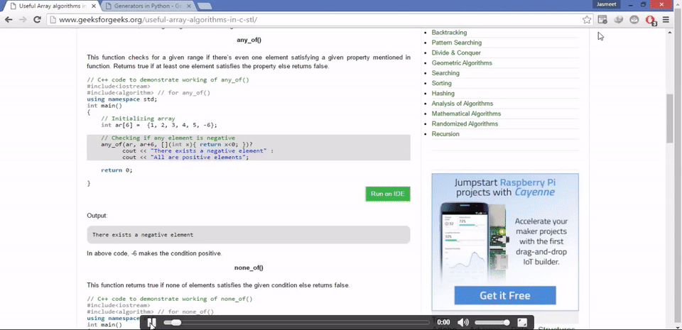

## CompilerIDE Chrome Extension

A chrome extension for my compilerIDE project, lets a user compile and run their code from any website.

* Download as zip.
* Extract the zip file.
* Open chrome://extensions in chrome and check the developer option
* Click on load unpacked extension and load the extension.
* Now select the code you want to run and according to the key binding, press the keys.

Demo
  

</img>
